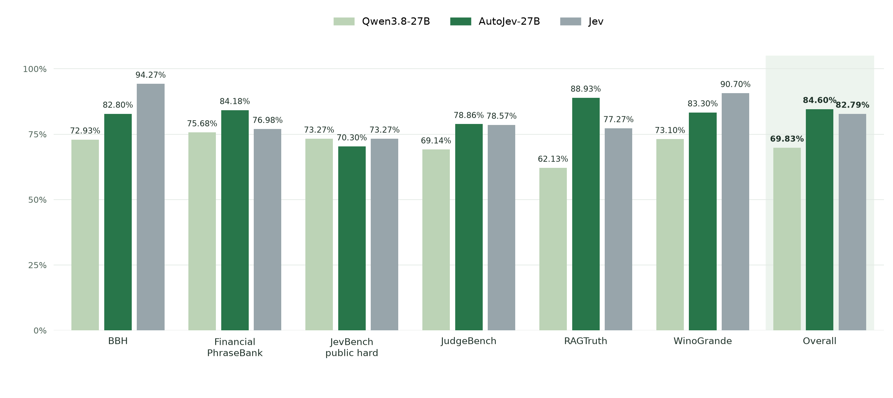
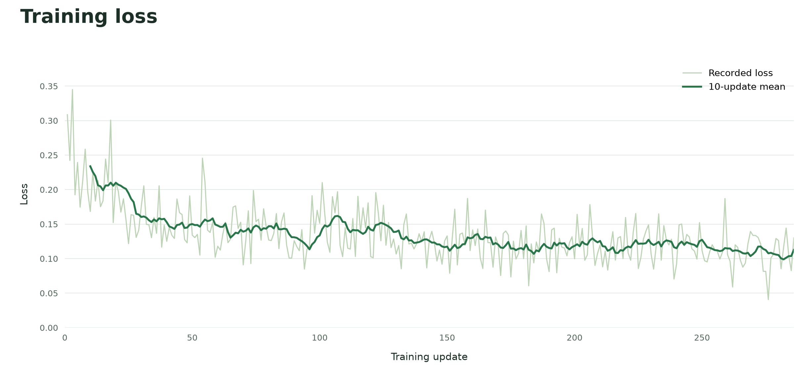

# Deciduous

Deciduous is the renamed continuation of AutoJev. 
Built with autonomous agents, from research and data generation to training, evaluation, and deployment. The user set the goals and refined the scope; agents executed the work.

Deciduous is a multimodal decision model. It returns probabilities over supplied choices in one forward pass per question, with a TypeSafe-compatible API and browser playground. The upstream AutoJev-27B release was a full-weight SFT of Qwen3.8-27B; the pinned base model here is [Ternary Bonsai 2 27B (GGUF)](https://huggingface.co/prism-ml/Ternary-Bonsai-2-27B-gguf), served through the PrismML llama.cpp runtime.

[Code](https://github.com/denis-pplx/autojev) · [Model weights](https://huggingface.co/denis-pplx/autojev-27b)

## Results



| Model | Overall accuracy ↑ | ECE ↓ | Brier ↓ |
|---|---:|---:|---:|
| Qwen3.8-27B | 69.83% | 0.06483 | 0.40834 |
| **AutoJev-27B** | **84.60%** | **0.04282** | **0.22027** |
| Jev | 82.79% | 0.05274 | 0.25400 |

## Training

**One H200 · full-weight SFT · 73,000 unique training examples · 286 updates.** The released model is checkpoint 200. Training uses cross-entropy; calibration fits a scalar temperature separately.



Run `bash configs/train.sh --help` for training arguments. The exact curated training corpus is not bundled.

## Run

Python 3.12+ and [uv](https://docs.astral.sh/uv/). Two run modes share one API.

### GGUF base (pinned default)

The pinned base is a ternary GGUF whose rotated weights execute only under the [PrismML llama.cpp fork](https://github.com/PrismML-Eng/llama.cpp) (stock llama.cpp, Ollama and LM Studio cannot run it). Start the server with the pinned files, then point deciduous at it:

```bash
uv sync --frozen --python 3.12
uv run hf download prism-ml/Ternary-Bonsai-2-27B-gguf Ternary-Bonsai-2-27B-PQ2_0.gguf Ternary-Bonsai-2-27B-mmproj-Q8_0.gguf --local-dir models/bonsai2
llama-server -m models/bonsai2/Ternary-Bonsai-2-27B-PQ2_0.gguf \
  --mmproj models/bonsai2/Ternary-Bonsai-2-27B-mmproj-Q8_0.gguf \
  --jinja -ngl 99 -fa on -c 32768 --temp 1.0 --top-p 0.95 --top-k 20 --min-p 0.05 \
  --host 127.0.0.1 --port 8080
DECIDUOUS_LLAMA_URL=http://127.0.0.1:8080 uv run deciduous-serve
```

Each decision renders the standard prompt with thinking disabled and reads the answer-position distribution over the 255 single-token answer codes, so probabilities arrive in one forward pass per question. Images go through the mmproj pack.

#### 1-bit band (PTQ1_0)

The same pinned revision also ships `Ternary-Bonsai-2-27B-PTQ1_0.gguf` (1.75 bits/weight, 5.27 GB): the identical ternary weights packed densely instead of one trit per 2-bit slot. Swap the `-m` file to serve it:

```bash
uv run hf download prism-ml/Ternary-Bonsai-2-27B-gguf Ternary-Bonsai-2-27B-PTQ1_0.gguf --local-dir models/bonsai2
llama-server -m models/bonsai2/Ternary-Bonsai-2-27B-PTQ1_0.gguf --jinja -ngl 99 -fa on -c 8192 --parallel 1 \
  --temp 1.0 --top-p 0.95 --top-k 20 --min-p 0.05 --host 127.0.0.1 --port 8080
```

Decisions are identical to PQ2_0 to four decimals (verified: the same distributions on text and noul probes), at 27% less disk. Run one band at a time on a single machine.

### MLX runtime (Apple Silicon, text)

The publisher's [MLX companion](https://huggingface.co/prism-ml/Ternary-Bonsai-2-27B-mlx-2bit) carries the same base as an affine 2-bit pack with its own bundled loader; stock MLX loaders skip the required transforms. Deciduous drives it in process:

```bash
uv sync --frozen --python 3.12 --extra mlx
uv run hf download prism-ml/Ternary-Bonsai-2-27B-mlx-2bit --revision fcba37d2117a7077eac6b613b2668d14d9779edd --local-dir models/bonsai2-mlx
DECIDUOUS_MLX_PACK=models/bonsai2-mlx uv run deciduous-serve
```

`MlxModel` (`deciduous.mlx`) loads the pack through its bundled runtime and reads the answer-position distribution straight from the logits, one forward pass per question. Text decisions only; route images through the GGUF band. The pack is pinned at revision `fcba37d2` (`MLX_REVISION`).

### Trained checkpoint

A GPU with space for approximately 49 GiB of BF16 weights plus runtime overhead.

```bash
uv sync --frozen --python 3.12
uv run hf download denis-pplx/autojev-27b --local-dir checkpoints/selected
DECIDUOUS_CHECKPOINT=checkpoints/selected uv run deciduous-serve
```

Open **http://localhost:8000** for the playground or `/docs` for the API. `POST /v1/systemone` supports `choice`, `noul`, `score`, and optional base64 `images`. Set `DECIDUOUS_API_KEY` to enable authentication. While the weights are private, authenticate with `uv run hf auth login` before downloading.

Use the included `DecisionModel` loader (trained checkpoints) or `BonsaiModel` (GGUF base) or the server. Published benchmarks measure text decisions; image support is not a natural-image accuracy claim.

## Decision Index evaluation

[Decision Index](https://huggingface.co/spaces/multimodalart/jev-decision-index) scores typed decision engines over a frozen 40-benchmark suite. The kit's `http` engine drives any `/v1/systemone` server, so a full run needs no harness code:

```bash
git clone https://github.com/apolinario/decision-index && cd decision-index
uv sync
uv run python -m decision_index run --engine http \
  --option base_url=http://127.0.0.1:8000 --option model=deciduous --out runs/deciduous-bonsai2-27b
uv run python -m decision_index score --runs runs/deciduous-bonsai2-27b
```

The suite dataset and one rebuilt source (HLE) are gated: `hf auth login` first. Runs checkpoint and resume; upload with `--upload <org>/<dataset>` and open a PR adding one line to `submissions/README.md` in the kit repo per its README.

## Training from the pinned base

Full-weight SFT cannot start from the pinned GGUF: its rotated ternary weights have no torch tensors, and no torch-native Bonsai 2 release exists. `deciduous-train` fails fast with this explanation unless `--base-model` names a torch-native repository; the released checkpoint's history (Qwen3.8-27B) is recorded in `configs/training.json`.

[Code: MIT](LICENSE) · [Weights: Apache 2.0](https://huggingface.co/denis-pplx/autojev-27b/blob/main/LICENSE) · Independent implementation inspired by Jev.
